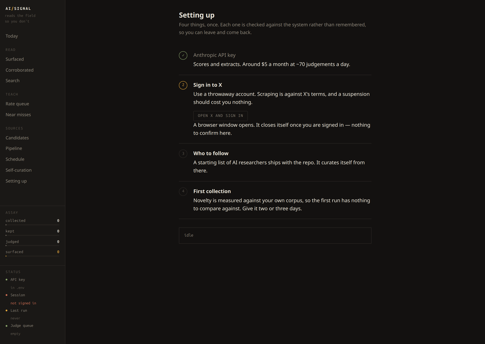
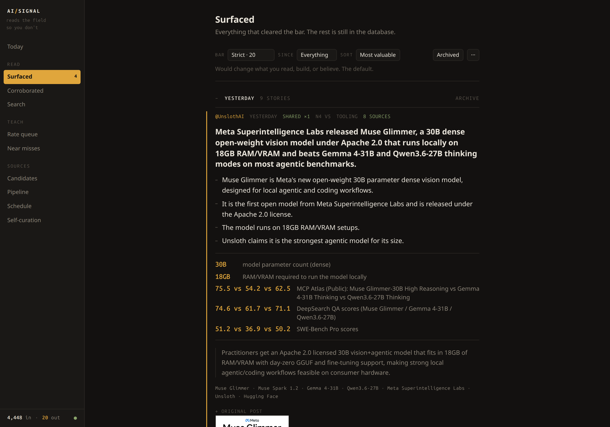
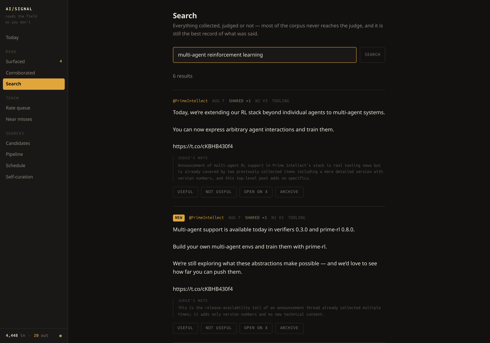
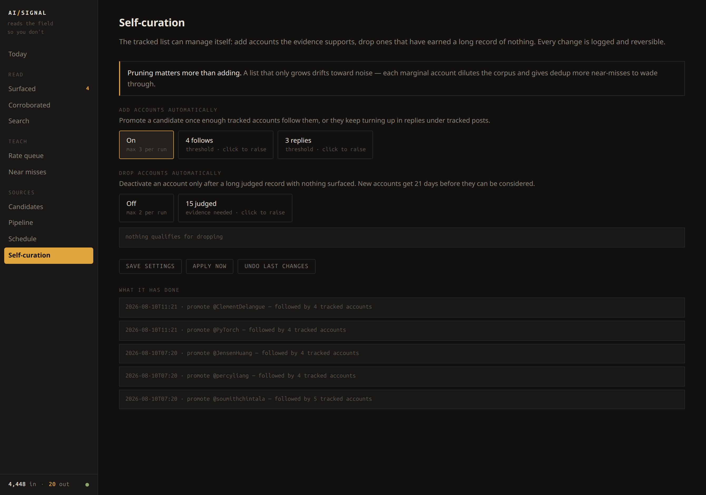
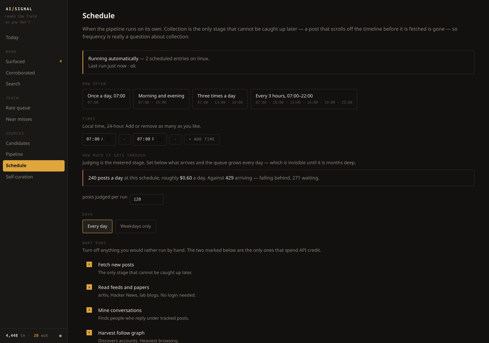
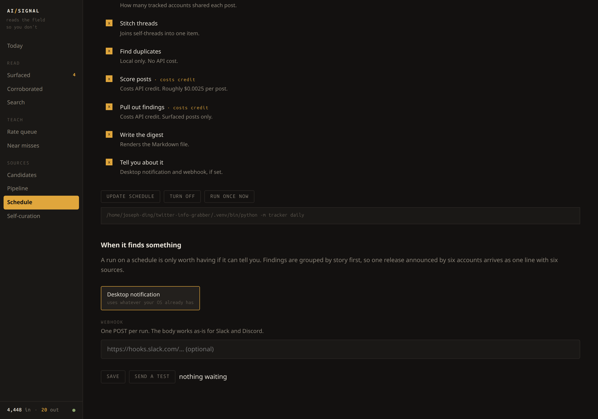

# AI Signal Tracker

[](https://github.com/josephs-ai/twitter-info-grabber/actions)
[](LICENSE)

Follows AI researchers across X, Weibo, Xiaohongshu, arXiv, Hacker News and
any RSS feed, and surfaces only what is both **new** and **worth reading** —
then extracts the actual findings, so you get the information rather than a
reading list.

A recent week: 4,538 posts collected across six sources, 526 reached the judge,
20 cleared the bar. One of them:

> **Training a single Transformer layer during RL post-training recovers most of
> the gains from full-parameter RL, with high-contribution layers concentrated in
> the middle 40–60% of the network.**
>
> - The pattern holds across 7 models, 3 RL algorithms, and math, code, and agentic tasks
> - Layer importance rankings stay correlated across datasets and tasks
>
> `1` layers trained · `40–60%` network depth · `7` models · `3` RL algorithms
>
> *Why it matters: post-training compute and memory can drop sharply by updating
> one selected layer instead of all parameters.*

That post came from an account with a few hundred followers. Nobody would have
told you to follow them.

---

## Read this before you start

**It scrapes X, which is against their terms of service.** Use a throwaway
account, never your own. Realistic worst case is that account getting
suspended. Collection is deliberately slow and low-volume, which helps, but the
risk is yours.

**It needs an Anthropic API key.** Judging costs about **$0.0025 a post**, and
you set how many it does — the Schedule page shows the rate, what it costs a
day, and whether it keeps up with what collection brings in. Around **$5/month**
at 70 posts a day; tracking 60 accounts properly is closer to 200 a day and
**$15/month**. The system prompt is cached, so most calls cost a fraction of a
cent.

**It is not useful on day one.** Novelty is measured against your own corpus, so
until there is a corpus, everything looks new. Give it two or three days of
collection before judging the output.

**It is a personal tool.** The data is the product; this repo is just the
machinery. Expect to edit `seeds.txt` and tune the judge to your taste.

---

## Setup

### Download a build

Grab the zip for your platform from
[Releases](https://github.com/josephs-ai/twitter-info-grabber/releases), unzip,
and run it. Nothing is installed. The app opens on a four-step setup page —
paste an API key, sign in, take the starter list, collect — and each step is
checked against the system rather than remembered, so you can stop halfway and
come back.



Chromium (~150MB) and the embedding model (~30MB) are fetched on first use
rather than bundled; both have to live somewhere writable, which a signed app
bundle is not. Your data lives outside the app, so replacing it with a newer
build keeps your corpus:

| | |
|---|---|
| Linux | `~/.local/share/ai-signal` |
| macOS | `~/Library/Application Support/AI Signal` |
| Windows | `%APPDATA%\AI Signal` |

Set `AI_SIGNAL_HOME` to put it somewhere else. **The builds are unsigned** —
macOS and Windows will say so; on macOS, right-click and Open the first time.

### Or run from source

Python 3.11+. A desktop session is needed for the app and for signing in.

```bash
git clone https://github.com/josephs-ai/twitter-info-grabber.git
cd twitter-info-grabber
python3 bootstrap.py          # any platform
```

A source checkout keeps everything in the project folder, exactly as before.
Then add your key to `.env` and sign in to a burner account:

| | Linux / macOS | Windows |
|---|---|---|
| sign in | `./run login` | `run.cmd login` |
| first collection | `./run collect --all` | `run.cmd collect --all` |
| full pipeline | `./run daily` | `run.cmd daily` |
| desktop app | `./run app` | `run.cmd app` |

`./run` and `run.cmd` are thin wrappers around `python -m tracker`, which works
directly if you prefer.

**Linux desktop launcher** — to start the app from your app grid instead of a
terminal:

```bash
./install-desktop.sh     # remove with: rm ~/.local/share/applications/ai-signal-tracker.desktop
```

### Scheduling

`daily` is idempotent, so run it as often as you like. Three times a day is
plenty.

**Linux / macOS** — `crontab -e`:

```
0 7,13,19 * * * /full/path/to/twitter-info-grabber/run daily >> /full/path/to/logs/daily.log 2>&1
```

Use absolute paths; cron does not run from your project directory.

**Windows** — Task Scheduler, or from PowerShell:

```powershell
schtasks /create /tn "AI Signal" /tr "C:\path\to\run.cmd daily" /sc daily /st 07:00
```

### Platform notes

Tested in CI on **Linux, macOS and Windows**, against Python 3.11 and 3.13.

The one genuinely platform-specific piece is the desktop app's GUI backend:
pywebview uses WebKit2GTK on Linux, Cocoa on macOS, and WebView2 on Windows.
The macOS and Windows dependencies come from PyPI automatically; Linux needs
system packages pip cannot provide (`python3-gi`, `gir1.2-webkit2-4.1`).

Everything else — collection, dedup, judging, extraction — is Python, SQLite
and a headless browser.

Run the same checks locally:

```bash
python tests/smoke.py
```

---

## How it works

Thirteen stages. Cheap deterministic filters first, the model only at the narrow
end.

| Stage | What it does |
|---|---|
| `collect` | Drives a browser, intercepts X's internal GraphQL responses. Not DOM scraping — the JSON shape is far more stable than the markup. |
| `sources` | Reads what needs no browser: RSS/Atom feeds, the arXiv API, Hacker News. Optionally Weibo and Xiaohongshu, which do need one. |
| `replies` | Mines conversations under tracked posts. Discovery *and* content: a sharp correction can outrank the post it replies to. |
| `suggest` | Harvests who tracked accounts follow, ranked by how many of them follow each candidate. |
| `links` | Resolves URLs, so "great paper: `<link>`" carries signal. arXiv abstracts get a dedicated path. |
| `curate` | Adds accounts the evidence supports and drops ones with a long record of nothing. See *How it adapts*. |
| `amplify` | Counts how many tracked accounts independently shared each original. Corroboration you cannot see post-by-post. |
| `threads` | Stitches self-threads into one unit. A 12-post thread is one idea, not twelve. |
| `dedup` | Embeds every post twice — lexical and semantic — and takes the max. Near-duplicates drop before any API call. |
| `judge` | Scores novelty and value separately, seeing the complete unit: thread, quoted post, link content, images, amplifier count. |
| `extract` | Pulls the headline, claims, figures, and entities out of whatever survived. |
| `digest` | Writes the day's findings to a Markdown file. |
| `notify` | Tells you, if anything cleared the bar. Desktop notification, webhook, or both. |

Three ideas do most of the work.

**Novelty is relative to your corpus, not to a model's training data.** Asking a
model "is this new?" gets you a judgement against a months-stale snapshot with
no idea what you have already been shown. Instead, each candidate is compared
against everything collected in a rolling window; borderline cases go to the
judge *with the similar prior posts attached*, turning a vague question into a
grounded comparison.

**Repetition is grouped, not dropped.** Six accounts announcing one model
release is one story with six sources — real corroboration, and the fact that
six people bothered is itself evidence. Dedup cannot catch this and should not
try: the posts are independently written and score 0.64–0.80 against each
other, under any threshold safe enough to use. So grouping happens at read time,
on the *extracted* headline rather than the raw post — extraction strips each
author's framing down to what happened, which pushes the same five posts to
0.79–0.86 and makes the underlying story comparable. Every member is kept; the
best-scored one leads and the rest become its sources.

**Nothing is ever deleted.** Dropped posts keep their similarity score, nearest
match, and drop reason. "What did the filter throw away, and was any of it
good?" stays a query rather than a guess.

---

## The app

`./run app` opens a real desktop window — the same Python the CLI uses, so
there is one implementation of every rule.



*What cleared the bar, with the findings extracted: headline, claims, figures
with units, and why it matters. The original post is collapsed underneath as
evidence rather than as the story. The slider at the top moves the bar and
re-filters everything already judged, instantly. `5 sources` on an entry means
five accounts reported the same thing independently.*



**Search** covers everything collected, judged or not — which matters, because
most of the corpus never reaches the judge and is still the best record of what
was said. It combines the semantic and lexical vectors already built for dedup
with a literal substring match, so a query finds posts that *mean* the same
thing while an exact string like `Qwen3-235B` still ranks first.

**The status panel** sits under the funnel because every failure this system has
is silent: an expired session collects nothing and looks exactly like a quiet
day. Session, last run, API key and judge queue are always on screen. `./run
doctor` prints the same four checks.

**Read state.** Posts you have not seen are marked `new`, and the count sits on
the Surfaced tab. Entries are marked read a couple of seconds after they render
— a view flashed past on the way somewhere else has not been read, and marking
it would discard the only signal that says what is new. Sorting by *Most
valuable*, *Newest* or *Unread first* is a click.

---

## How it adapts

Three loops, each closing a different gap. All three are visible in the desktop
app (`./run app`).

### You teach it what you value

The judge ships with a generic idea of what matters. Yours is specific and will
not survive contact with one.

```bash
./run review --rate     # walk through decisions, rate each
```

Ratings become few-shot examples in the judge's prompt. **Disagreements teach it
most** — a post it skipped that you rated useful is a correction, and those are
weighted first. Because the examples sit in the cached prefix they cost almost
nothing per call. After editing the prompt, bump `PROMPT_VERSION` in
`tracker/judge.py` and run `./run replay` to see which verdicts changed.

### It curates its own sources




```bash
./run curate            # preview
./run curate --apply
./run curate --history  # what it did, and on what evidence
./run curate --undo
```

**Promote** — a candidate several tracked accounts follow, or who keeps turning
up replying under their posts, gets tracked automatically.

**Demote** — an account with a long judged record and nothing surfaced gets
deactivated. This is the half usually left out and it matters more: a list that
only grows drifts toward noise, diluting the corpus and giving dedup more
near-misses to wade through.

Three rails keep it from running away — evidence minimums so nothing acts on a
thin record, per-run caps so a bad threshold costs three accounts rather than
fifty, and a grace period so a new account gets time to prove itself. Every
change is logged with its evidence and is reversible. **Both halves ship off**;
how much autonomy the roster gets is your call.

### You set the bar, and can move it freely

Five levels from Everything to Severe. The model's novelty and value *scores*
are a reading of the post and do not change when your taste does — only the bar
you hold them to changes. So the bar is applied **when results are read**, not
frozen into the stored verdict.

That is what makes it worth having: moving the slider re-filters every post
already judged, instantly and for free. No re-judging, no API calls, nothing
rewritten. The slider shows how many posts each level would surface before you
commit to it.

---

## Maintenance

Mostly none — but two things are worth knowing.

**Storage.** Embeddings are about 9KB per post, and dedup only ever looks at a
rolling window, so vectors outside it are dead weight — roughly 6GB a year if
left alone. `./run dedup --apply` prunes them automatically. Run `VACUUM` on the
SQLite file occasionally to reclaim the space on disk.



**Scheduling.** `./run schedule` shows and sets when the pipeline runs, writing
to cron or Task Scheduler. Entries carry a marker and only marked lines are ever
touched, so it never disturbs anything else in your crontab.

**Admission control.** Judging is the only metered stage, so what enters its
queue is a spending decision — and for a long time nothing bounded it. The queue
was fed by however deep collection happened to scroll, which means a bigger
scrape cost more money without producing more signal: on this corpus, 684 of
1,300 waiting posts were already over a week old when they were fetched.

A post that was old when you first saw it is history, not news. It still earns
its place in the corpus — history is the baseline dedup compares against — it
just should not be paid for as if it were today's finding. So anything older
than `admit_max_age_days` (default 3) when collected is held back, marked
`backfill`, and never deleted:

```bash
./run judge --backfill        # work through the held-back pool deliberately
```

Applying this took the live queue from 1,303 to 252 in one pass. Input now
tracks the collection *rate* rather than the depth of whatever back catalogue a
new source exposes — which matters more with every source you add.

**The judge queue.** This is the one dial worth understanding. Judging is
metered per post, so how many a run gets through is both a quality decision and
a cost decision — and if you set it below what collection brings in, the queue
grows every day, which is invisible until it is months deep. The Schedule page
states both numbers and whether they balance:

> **240 posts a day** at this schedule, against **186** arriving. Keeping up.
> Roughly **$0.60** a day.

A purely newest-first queue means anything that falls behind never catches up,
so a quarter of every run goes to the oldest waiting posts. Posts older than the
45-day novelty window are retired unjudged — they have no neighbours left to
compare against, so a novelty score for them would be meaningless. `./run
doctor` reports the depth.

---

## Sources other than X

X needed a browser, an interception layer and a burner account. Most of what is
worth reading needs none of that:

| Source | Needs | Notes |
|---|---|---|
| `rss` | nothing | 13 lab and researcher feeds, checked live. Anthropic publishes none, which is why the lab you would expect is missing. |
| `arxiv` | nothing | The Atom API. Everything else here is people reacting to papers; this is the paper, including the ones nobody amplified. |
| `hn` | nothing | The Firebase API. Where a release gets argued with — the person explaining why the benchmark is misleading is in those comments. |
| `weibo` | nothing | The mobile site returns search results logged out. Closest in shape to X and the better of the two Chinese sources. |
| `xhs` | a login | Xiaohongshu. Its API answers nothing without a session. |

```bash
./run sources                 # rss, arxiv and hn — the default sweep
./run sources --only cn       # Weibo and Xiaohongshu, never automatic
./run login --service xhs     # separate browser profile per service
```

**Yield is worth watching, because a source that collects a lot and surfaces
nothing is not free** — every post it adds is money at the judge. `./run stats`
reports it:

```
  source    collected  judged  surfaced   mean
  x              3876     334         8   1.40
  arxiv            80      40         9   2.65
  hn               51      20         3   2.35
  rss             375       7         0   1.86
  weibo            60      31         0   1.39
  xhs              96      94         0   1.06
```

Read that column of means before deciding what to track. **arXiv surfaces 23%
of what it submits to the judge; X surfaces 2.4%** — a paper is ten times more
likely to be worth your attention than a post about a paper, which is roughly
what you would expect and not at all how this project started. Hacker News is
second. The tool began as a way to follow people on X and its own numbers now
argue for papers and forums first.

That table is also why **Xiaohongshu's keyword search is off by default**. It does
return AI content, and the judge then scored 90 notes at a mean value of 1.07
out of 5 with none clearing the bar: searching a mass-market platform finds
mass-market writing — "deploy a model on your PC from zero", "7 AI concepts in
one diagram", interview-prep guides. Pass keywords explicitly to turn it back
on. Tracking specific Xiaohongshu profiles still works and is a different
proposition.

### Reading Chinese

Set this before collecting anything non-English:

```bash
echo "AI_SIGNAL_EMBED=multilingual" >> .env
./run dedup --apply          # re-embeds locally, no API cost
```

The default embedder is English-only, and it does not fail safely on Chinese —
it fails *confidently*. Measured on real posts, it scored these pairs as
duplicates of each other:

| | |
|---|---|
| 0.942 | a closed-door private equity meeting **vs** an essay on what "AI flavour" in writing is |
| 0.957 | a conference countdown quoting Borges **vs** how a company lost a fortune reselling Office |

Both are past the 0.92 duplicate threshold, so unrelated posts were silently
dropped as repeats. The multilingual model scores the same pairs at 0.044 and
0.126, and barely moves English (0.800 against 0.839). It costs 1GB against
59MB, which is the only reason it is not the default.

---

## Being told

A filter that runs on a schedule is only worth having if it can reach you.
Otherwise you go back to checking a feed, which is the habit this replaces.



```bash
./run notify --desktop on
./run notify --webhook https://hooks.slack.com/…    # Slack, Discord, anything
./run notify --dry-run                              # see the message, send nothing
```

Both channels are off until you set them, and the same settings live on the
Schedule page. The message is grouped by story first, so one release announced
by six accounts arrives as one line with six sources — a notification that
repeats itself gets muted within a day. A watermark makes delivery exactly-once,
and it is deliberately one-directional: loosening the strictness bar does not
fire three hundred notifications for posts it newly admits.

## Commands

```
collect   sources   replies   suggest   links   curate   amplify
threads   dedup     judge     extract  digest  notify   the pipeline, in order

daily     run every stage once      app       open the desktop app
search    query everything collected, judged or not
schedule  when it runs by itself    doctor    check session, db, last run
notify    announce findings; set desktop and webhook
review    read past judgements      rate      record what you thought
replay    re-judge under a new prompt         stats     what is in the database
accounts  who is tracked            candidates  who was discovered
sources   read feeds, papers and forums without a browser
login     sign in — `--service x|weibo|xhs`, each with its own profile
```

```bash
./run accounts --add weibo:1402400261     # track a Weibo user by uid
./run accounts --add xhs:5f8a1b2c3d4e     # or a Xiaohongshu profile
./run sources --add https://example.com/feed.xml --title "A blog"
./run sources --only cn                   # Weibo and Xiaohongshu, deliberately
./run stats                               # yield per source — see below
```

`./run doctor` when something seems wrong. `./run <cmd> --help` for options.
Most stages have a dry-run mode and print what they *would* do first.

---

## Things that will bite you

**The session expires.** `./run doctor` tells you; `./run login` fixes it.

**X renames GraphQL operations occasionally.** Collection logs every operation
it sees, so the fix is usually adding one string to `TIMELINE_OPS` in
`tracker/parse.py`.

**Some accounts restrict who can view their posts.** Their threads come back as
tombstones. Following them from the burner usually fixes it.

**Container churn breaks Chromium.** If `ERR_NETWORK_CHANGED` appears
repeatedly, something on your machine is creating and destroying network
interfaces — Docker restart loops are the usual cause. Chromium treats each as
a network change and aborts in-flight requests.

---

## Layout

```
tracker/     the pipeline, one module per stage
ui/          desktop app front end (plain HTML, no build step)
packaging/   PyInstaller spec and the frozen entry point
spike/       the throwaway proof that GraphQL interception works
schema.sql   the database, heavily commented
SPEC.md      the original design and why each decision was made
seeds.txt    who is tracked — edit this
```

Everything reads from one SQLite file. Swap the collection layer and nothing
downstream notices.

`tracker/paths.py` decides where things live. From a checkout, code and data
share the project folder. Packaged, code is read-only inside the bundle and data
goes to the per-user location — so an update can replace the executable without
touching your corpus. Build one yourself with:

```bash
pip install pyinstaller
pyinstaller packaging/aisignal.spec --noconfirm
```

---

## Contributing

The parts most likely to need work from someone other than me:

- **Collection breaks when X changes.** If an operation gets renamed, the fix is
  usually one string in `tracker/parse.py` — `collect` logs every GraphQL
  operation it sees precisely so this stays a one-liner.
- **The lexical + semantic embedding pair is a compromise.** It avoids a 2.5GB
  torch install at some cost in accuracy. `tracker/embed.py` takes any backend
  exposing `encode()`; a real sentence-transformer would drop straight in.
- **Only Linux has been used in anger.** CI runs the suite on macOS and Windows,
  but nobody has actually lived with the app there — the desktop notification
  paths in `tracker/notify.py` especially would benefit from a real user.

Keep the two invariants: **nothing is ever deleted** (dropped posts keep their
reason so filtering stays auditable), and **cheap filters run before expensive
ones** so model calls stay at the narrow end of the funnel.

---

## License

[Apache License 2.0](LICENSE). Use it, fork it, ship it — keep the notice.

The license covers this code. It does not grant you rights to the posts it
collects, and it is not permission to violate X's terms of service; that call is
yours.
